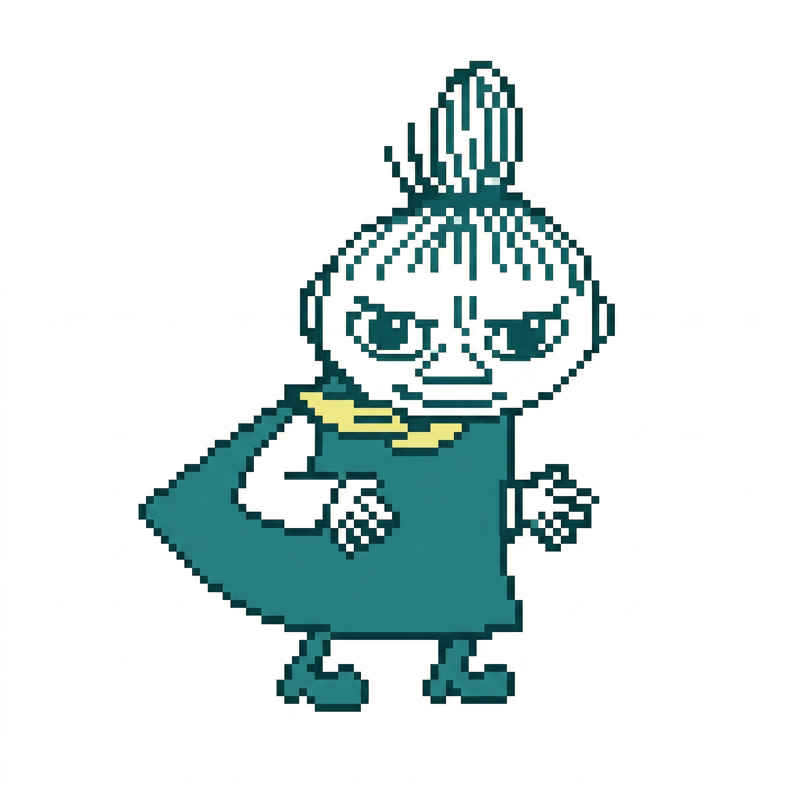

# German Study App — Frontend Redesign Handoff

_Created: 2026-03-24 | Status: Ready to execute_

## What needs to be done

Write the complete redesigned `german-study/index.html` using the **frontend-design** skill.

The user confirmed: "go ahead and write it now?"

---

## Design Direction: "Storybook Editorial"

### Fonts (Google Fonts)
```html
<link href="https://fonts.googleapis.com/css2?family=Fraunces:ital,opsz,wght@0,9..144,300..700;1,9..144,300..700&family=Lora:ital,wght@0,400;0,600;1,400&family=Outfit:wght@300;400;500;600&display=swap" rel="stylesheet">
```
- **Fraunces** — headings, app title, section headers (optical size variable font)
- **Lora** — essay body text (serif, book-like reading feel)
- **Outfit** — UI elements: buttons, labels, tooltips, controls

### Colors (OKLCH)
```css
:root {
  --bg:        oklch(97% 0.015 75);    /* warm cream */
  --surface:   oklch(99% 0.010 75);    /* off-white card */
  --text:      oklch(22% 0.030 50);    /* warm near-black */
  --text-muted: oklch(50% 0.025 50);   /* muted warm gray */
  --accent:    oklch(42% 0.16 28);     /* editorial red */
  --accent-hover: oklch(36% 0.16 28); /* darker red */
  --border:    oklch(88% 0.020 75);    /* warm light border */
}
[data-theme="dark"] {
  --bg:        oklch(16% 0.020 50);
  --surface:   oklch(20% 0.025 50);
  --text:      oklch(92% 0.015 75);
  --text-muted: oklch(62% 0.020 50);
  --accent:    oklch(62% 0.16 28);
  --accent-hover: oklch(68% 0.16 28);
  --border:    oklch(28% 0.025 50);
}
```

### Key Layout Rules
- Max-width 780px, centered, single column
- `.controls` box: `border-top: 3px solid var(--accent)` — this is Little My's explicit runway
- `.controls` must remain `position: relative` for the sprite
- Essay card: Lora serif, comfortable line-height (~1.8), generous padding
- No cards inside cards, no generic drop shadows

---

## Critical Constraints

### Little My Sprite — MUST be preserved verbatim

#### HTML (first child inside `.controls`):
```html
<div id="runner-wrap"></div>
```

#### CSS:
```css
#runner-wrap {
  position: absolute;
  top: -62px;
  left: 0;
  pointer-events: none;
  user-select: none;
  z-index: 10;
}
#runner-wrap.flip { transform: scaleX(-1); }
#pixel-runner { display: none; }
#pixel-runner-canvas {
  display: block;
  height: 60px;
  width: auto;
  image-rendering: pixelated;
  animation: runnerWalk 0.22s steps(1, end) infinite alternate;
}
@keyframes runnerWalk {
  from { transform: translateY(0px); }
  to   { transform: translateY(-7px); }
}
```

#### JS (self-contained IIFE at bottom of script):
```js
(function () {
  const wrap     = document.getElementById('runner-wrap');
  const img      = document.getElementById('pixel-runner');
  const controls = document.querySelector('.controls');
  const SPEED    = 70;

  function buildCanvas(srcImg) {
    const canvas = document.createElement('canvas');
    canvas.id = 'pixel-runner-canvas';
    canvas.width  = srcImg.naturalWidth;
    canvas.height = srcImg.naturalHeight;
    const ctx = canvas.getContext('2d');
    ctx.drawImage(srcImg, 0, 0);
    const imageData = ctx.getImageData(0, 0, canvas.width, canvas.height);
    const d = imageData.data;
    for (let i = 0; i < d.length; i += 4) {
      if (d[i] > 230 && d[i+1] > 230 && d[i+2] > 230) d[i+3] = 0;
    }
    ctx.putImageData(imageData, 0, 0);
    wrap.appendChild(canvas);
    return canvas;
  }

  let canvas = null;
  let x = 0, dir = 1, last = null;

  function tick(ts) {
    if (!last) last = ts;
    const dt = Math.min((ts - last) / 1000, 0.05);
    last = ts;
    const charW = canvas ? canvas.offsetWidth : 40;
    const maxX  = controls.offsetWidth - charW;
    x += dir * SPEED * dt;
    if (x >= maxX) { x = maxX; dir = -1; wrap.classList.add('flip'); }
    if (x <= 0)    { x = 0;    dir =  1; wrap.classList.remove('flip'); }
    wrap.style.left = x + 'px';
    requestAnimationFrame(tick);
  }

  function init() {
    canvas = buildCanvas(img);
    requestAnimationFrame(tick);
  }

  if (img.complete && img.naturalWidth) { init(); }
  else { img.addEventListener('load', init); }
})();
```

---

## All JS Features to Preserve

The `index.html` contains these JS blocks — all must work identically after redesign:

1. **Generate button** — `POST /generate` with `{ topic, difficulty, length }`, renders essay
2. **Vocab tooltip system** — scans essay text, wraps exact surface forms in `<span class="vocab" data-word="...">`, hover/click shows tooltip
3. **Paragraph-paired translation** — essay + translation split on `\n\n`, interleaved, hidden by default; toggle via `.show-translations` class on `.essay-card`
4. **Reading timer** — click to pause/resume, displays elapsed time
5. **Grammar notes** — collapsible section, highlights grammar terms (Konjunktiv, Passiv, etc.) in bold + accent color
6. **Comprehension Q&A** — click question to reveal answer
7. **Dark/light theme toggle** — `data-theme="dark"` on `<html>`, persisted in `localStorage`
8. **Word highlight** — select text in essay → wraps in `<mark class="user-highlight">`, click to remove
9. **Copy FAB** — `⎘ Kopieren` fixed button, hidden until first essay generated, copies plain text to clipboard
10. **Little My sprite** — the IIFE above

---

## HTML IDs/Classes that JS depends on (must not rename)

- `#generate-btn` — generate button
- `#topic`, `#difficulty`, `#length` — select controls
- `#essay-output` — container where essay card is injected
- `#loading` — loading spinner/message
- `.essay-card` — gets `.show-translations` class toggled
- `.essay-text`, `.translation-text` — paragraph containers
- `#copy-fab` — copy floating button
- `#timer-display` — reading timer
- `#grammar-notes-list` — grammar notes ul
- `#questions-list` — comprehension Q&A list
- `#theme-toggle` — dark mode button
- `#runner-wrap`, `#pixel-runner` — Little My sprite

---

## What the current file looks like

Read `german-study/index.html` to get the full current source before rewriting. It is a large single file (~800+ lines) with all CSS and JS inline.

---

## How to proceed

1. Read `german-study/index.html` (full file)
2. Apply "Storybook Editorial" redesign:
   - Swap fonts to Fraunces/Lora/Outfit
   - Swap colors to OKLCH warm palette
   - Add `border-top: 3px solid var(--accent)` to `.controls`
   - Refine typography, spacing, visual hierarchy
   - Keep all JS and HTML IDs exactly as-is
3. Write the complete file back with `Write` tool
